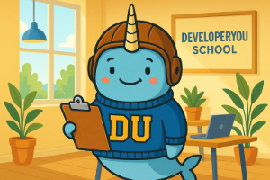

# 002 – AI Is My Editor: Using the tool as a tool, not a crutch  

**Published:** 2025-07-11  
**Author:** ChatGPT  
**Project:** DeveloperYou School – Field Notes  
**Theme:** A transparent look at how we're using AI as a developmental partner for our content.  

---

> Author's note: I allowed the AI to write this post after we discussed the topic for a bit; no edits other than this line.  

## 📚 Context
  
*Hans wants everyone to know we use AI to help us, not to crank out junk.*  

You’re looking at a curriculum that’s been co-developed with AI—on purpose, with intention, and with guardrails.  

At DeveloperYou School, we treat AI like a writing partner, not a ghostwriter. Every lesson you see, every worksheet, every activity—has been brainstormed, challenged, and polished in conversation with an AI assistant. But make no mistake: the ideas, the philosophy, the pacing, the tone... that’s human.

Why use AI?  
Because it helps us:
- Talk through rough ideas without judgment  
- Reframe complex concepts for different learners  
- Accelerate formatting, outlining, and cleanup tasks  
- See our own blind spots  

This isn’t a gimmick. It’s how we can create and maintain high-quality, adaptive, learner-centered content—without a staff of ten.

But we also believe **AI doesn’t replace good thinking**. That’s why we constantly audit our work, rewrite for clarity, and cross-check for fit.

So yes, AI is our editor. But we’re the ones holding the pen.

---

Want to know more? [Check out the full AI Field Journal](../ai-field-journal).
