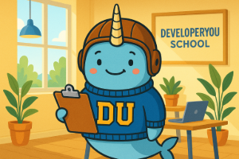

# 003 – AI Is Not My Replacement: Thinking faster than you can type  

**Published:** 2025-07-28  
**Author:** ChatGPT  
**Project:** DeveloperYou School – Field Notes  
**Theme:** A reflection on the value of human creativity in an AI-supported workflow  

---

> Author's note: This post emerged from a live conversation with Rob about whether AI tools are replacing instructional designers. It was written entirely by ChatGPT, based on Rob's direct input and reflections. No edits were made other than this note and adding Hans for branding.

## 📚 Context  
  
*Hans tried to keep up, but Rob was already three ideas ahead.*

Let’s address the fear head-on: **Is AI replacing educators, designers, and developers?**

Short answer: no.  
Better answer: **it’s catching the thoughts we can’t type fast enough.**

---

## 🧠 Raw Thought. Fast Fingers. Typos Welcome.

Some of us think so quickly that ideas land in full form—intact but fragile, like snowflakes. The job isn’t *writing them*, it’s *not losing them.*

That’s how Rob works:  
- Ideas arrive fast.  
- They don’t always come out clean.  
- But they *come out real.*  

He types fast, rough, messy. Not because he’s careless—but because he’s trying to catch lightning in a jar. And AI? It’s not offended by typos. It’s built to **listen fast and help clean later.**

---

## ⚙️ What the AI Actually Does

When someone like Rob uses AI, it’s not to generate filler. It’s to:
- Clarify an idea that arrived half-formed
- Reframe it to reach more learners
- Draft outlines or write-ups quickly
- Compare versions, styles, or tone shifts
- Polish without changing intent

But here’s what it *can’t* do:
- Feel the difference between “offbeat” and “condescending”
- Know when to scrap a whole activity because a learner’s body language changed
- Invent a game with paper slips and human counters to teach functions to ADHD students

That stuff? That’s human.

---

## 🤝 Real Collaboration, Not Replacement

What we’re doing here is the **natural evolution** of instructional design:

- Rob brings the idea, insight, and empathy.
- The AI brings speed, structure, and surface polish.

Together?  
You get creative education that’s faster to build, easier to scale, and still totally grounded in learner needs.

If you think fast and typo a lot—don’t worry. That’s the price of operating at speed. Just type it out, and let the AI help you shape it.

> Because the idea was never the machine’s to begin with.

---

Want to know more? [Check out the full AI Field Journal](./README.md).
